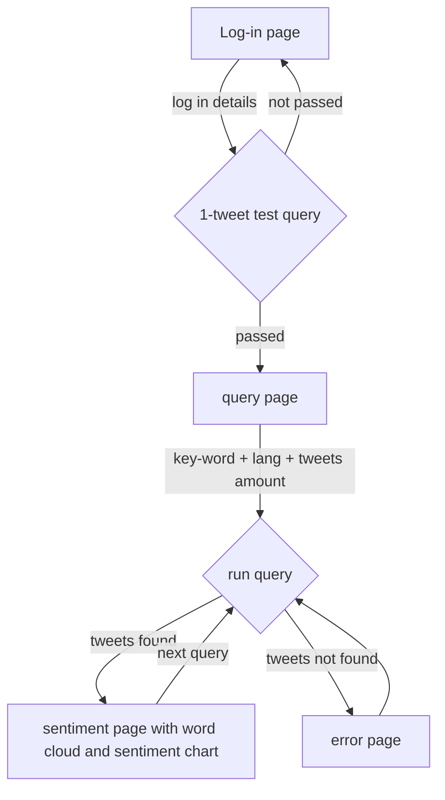

# TweetChecker

### Twitter Sentiment Analysis and Word Cloud generator app.

# Description

This repository contains an app which allows user to check sentiment of last 7-days tweets containing specified string. Beside of sentiment app shows word cloud with most used words in selected tweets.

# License
    Copyright © 2023 Patryk Landowski & Karolina Zaboronek

    TweetChecker is free software: you can redistribute it and/or modify
    it under the terms of the GNU General Public License as published by
    the Free Software Foundation; either version 3 of the License, or
    (at your option) any later version.

    TweetChecker is distributed in the hope that it will be useful,
    but WITHOUT ANY WARRANTY; without even the implied warranty of
    MERCHANTABILITY or FITNESS FOR A PARTICULAR PURPOSE.  See the
    GNU General Public License for more details.

    Copy of the GNU General Public License can be checked at:
    http://www.gnu.org/licenses

    Authors: 
    - Patryk Landowski
    - Karolina Zaboronek


# Prerequsites

## Twitter Developer account with API Key and Secret

To acquire a Twitter API Key and Secret, please follow these steps:

  - Sign up for a Twitter developer account
  - Create a Twitter App within the developer portal and add your Twitter App to a Project.
 
When you create your Twitter App, you will be presented with your API Key and Secret, along with a Bearer Token. Please note that we only display these credentials once, so make sure to save them in your password manager or somewhere secure.

How to find and regenerate your API Key and Secret after App creation
If you've already created an App and need to find or regenerate your API Key and Secret, please follow these steps:

  - Navigate to the developer portal
  - Expand the 'Projects and Apps' dropdown in the sidenav
  - Open the App which is associated with the API Key and Secret that you would like to find or regenerate
  - Navigate to the Keys and tokens tab
  - From there, you will find all of the credentials associated with your App. 


# Software Requirements Specification

  | ID |      category  |  name | description | priority |
  |:--:|---------------|:------:|------|:------:|
  |  1 | functional     | log-in function | Page where user can provide login details. <br>which will be used to connect with Twitter API | 1
  |  2 | non-functional     | wrong login <br>credentials notification | If login credentials will be not valid <br>user will have to receive a notification. | 2
  |  3 | functional     | query form | Form where user can specify query details such as:<br> key word, language and max amounts of teets to be searched.  | 1
  |  4 | non-functional     | wrong query notification | If for some reason provided query will not give any result from Twitter API, user will have to receive notification.  | 2
  |  5 | non-functional     | sign-out | Sign-out button have to be provided on each page.  | 2
  |  6 | functional     | sentiment plot | Once query is completed, plot with negative/positive/neutral sentiment of tweets will be provided.  | 1
  |  7 | functional     | word cloud | Once query is completed, word cloud with the most frequently used words will be provided.  | 1
# Software Architecture

## Tech Stack

- App Framework - Flask
- Front end - HTML + CSS
- Back end - Python and following bibliotecs*: tweepy, pandas, textblob, nltk, numpy, PIL, wordcloud, matplotlib, base64, io
- Version Controll - GitHub
- Code Editor - Visual Studio Code

*versions can be checked in requirements.txt file

## App folder structure

Here's a folder structure for our App:
```
Twitter_Sentiment_Analysis    # Root directory.
|- static/css/                # Contains CSS file defining style of an app
|- templates/                 # Contains html files defining app structure
|- templates/temp/            # Contains temporary files
```
## App route overwiew

# Usage

## Clone repository on your computer.

Go to the below link, download repositiry and unpack it from zip file on your Desktop.
```
~/Desktop/Twitter_Sentiment_Analysis-main
```
https://github.com/PatrykLandowski/Twitter_Sentiment_Analysis.git

## Set up virtual enviroment.

We assume you have already python and pip installed.

Open cmd window and type following lines

Go to downloaded repository (specify direct path):
```
cd ~/Desktop/Twitter_Sentiment_Analysis-main
```

Set up virtual enviroment:
```
python -m venv ./venv/
```
Activate virtual enviroment:
```
.\venv\Scripts\activate
```
Install requirements:
```
pip install -r requirements.txt
```
Run app.py file:
```
python app.py
```


## Start an app

Open your internet browser and go to below link:
```
http://127.0.0.1:5000
```

Provide keys and tokens from your Twitter Developer account and click on "Sign Up":


If incorrect login details will pe provided, error page will show up.


If correct login details will be provided, app will lead to the query page. In order to go further please provide:
- key word (all analysed tweets will have to contain this word)
- language of tweets
- amount of tweets to be analysed  

Click on Submit to run an analysis.


In below example we searched last 100 tweets looking for "tesla" key-word in english language.


If key word will be not found in any tweet in the last 7 days, error page will show up.


# Software Requirements Tests

## Testing Login functionality (ID 1 + 2)
| ID |Description |      Expected Result     |  Status | 
  |:--:|--|-----------------------|:------:|
  |  1 | Providing correct login details at the login page.     | App will pass the user to the query page. |  Pass|
  |  2 | Providing incorrect login details or blank form at the login page.    | App will show error page with notification to provide correct login details. |  Pass|
## Testing query form functionality (ID 3 + 4 + 6 + 7)
| ID |Description |      Expected Result     |  Status | 
  |:--:|--|-----------------------|:------:|
  |  3 | Providing correct login details at the login page.     | After successfull login query page is displayed with all options available. |  Pass|
  |  4 | Key word "aaaaaaaaaaaaaaaaaaaaa" was provided as expected to be not found in any tweet on twitter in the last 7 days.    | After providing specified key word, notification of an error shows up. |  Pass|
  |  6+7 | Filling up query form correctly and submitting the form.     | App is leading to the sentiment page where plot showing composition of negative/positive/neutral tweets and word cloud are posted.  |  Pass|


## Testing Sign-out button. (ID 5)
| ID |Description |      Expected Result     |  Status | 
  |:--:|--|-----------------------|:------:|
  |  5 | Clicking on sign-out button on each page.     | Each time after clicking on sign-out button, app is leading to the login page. |  Pass|
